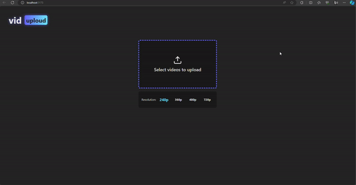

<h1 align="center">
   Pre processing videos on browser
</h1>
 

  <a href="#-projeto">Project</a>&nbsp;&nbsp;&nbsp;|&nbsp;&nbsp;&nbsp;
  <a href="#-tecnologias">Technologies</a>&nbsp;&nbsp;&nbsp;|&nbsp;&nbsp;&nbsp;
  <a href="#-usage">Usage</a>&nbsp;&nbsp;&nbsp;|&nbsp;&nbsp;&nbsp;
  <a href="#-participants">Participants</a>

 

## 💻 Project

🔊 These project was made with Solid. The purpose of the application is to pre process videos on the browser, using web workers to don't block the main thread of the browser and web streams to process by demand... It was developed during @ErickWendel Semana JS Expert... 💚

    

## 🚀 Technologies

This project was developed with the following technologies:

- [Solid](https://www.solidjs.com/)
- [MP4Box](https://github.com/gpac/mp4box.js/)
- [WebM Writter](https://github.com/thenickdude/webm-writer-js)
- [Typescript](https://www.typescriptlang.org/)

## 💻 Usage

 ### App

    $ it was developed using node v18.15

    $ if you want to test, just clone the project and run 'npm install'

    $ then run 'npm run dev'
 
## Next steps

- [ ] - Webmwriter-2.js add types to the functions that I call (addFrame, complete)
- [ ] - Fix error when seeking the video in a step other than the start;
- [ ] - Encoding and decoding of audio track

## 👥 Participants

[Samuel Formigheri](https://github.com/SamuelFormigheri)